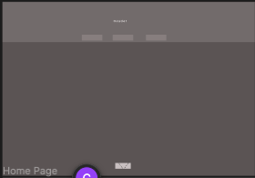
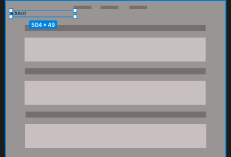
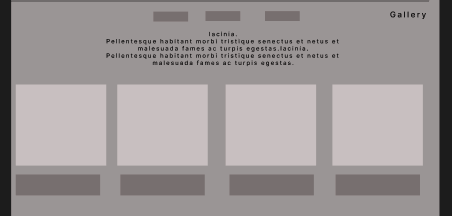
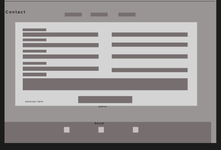
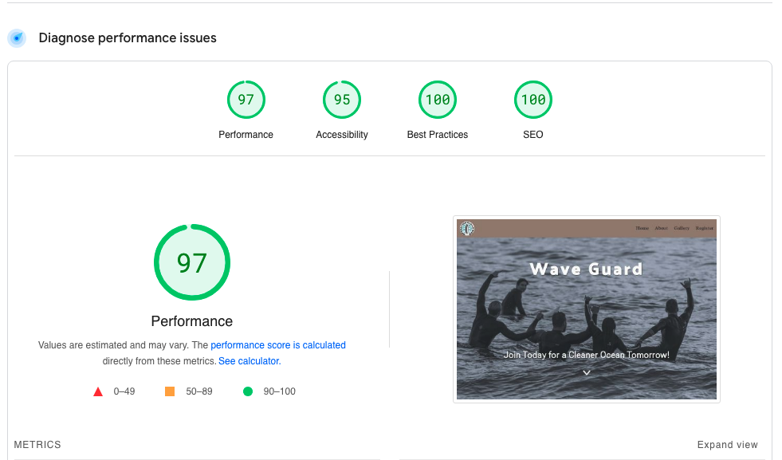
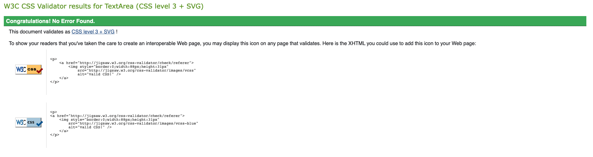
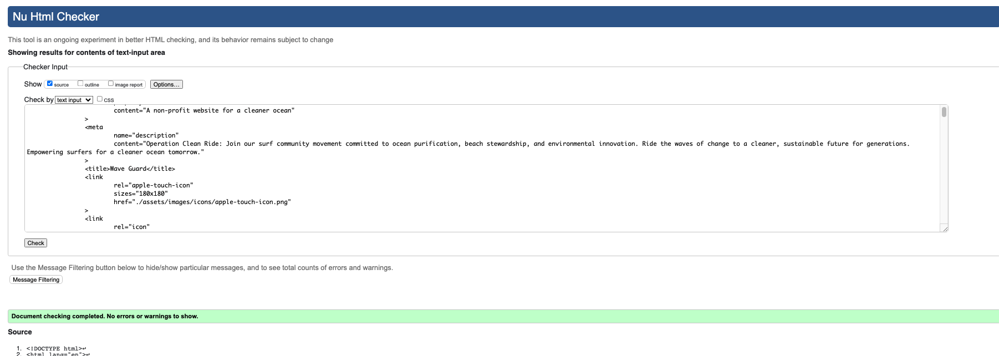

# Portfolio-Project-1

<h2>Project 1-Wave Guard: Non-profit Organization Website </h2>

Wave Guard is a project base website to develope the basic skills of html and css learned in Code Institute programming course. Although a fictional orginaztion the core concept of brining contiue awareness of maintaining a clean ocean is vital to our planet and survial of all species. 

Craig Britton 

<h3>craigb73.github.io/wave-guard</h3>  

<h2>Contents</h2>

<ol>
<li href="#planning">User Experience</li>
<li href=="#features">Website Features</li>
<li>Technology Used</li>
<li>Testing</li>
<li>Deployment</li>
<li>Credits</li>
<li>Content and Resources</li>
</ol>

<h2 id="planning" >User Experience</h2>

<h3>Project planning</h3>   

After reading though the options for my first portfolio project I decided to create a website based on something that I have a real instrest an passion for, Earths oceans. I believe that there can never be enough awareness of maintaining a clean and healthy ocean. 

<strong>Research:</strong> Determining potentional website users, I decided on the surfing community.  The surfing community spans globally and all share a special connection with ocean and understand the importance of keeping it clean.

<strong>As a User:</strong>

<ul>
<li>I like to view stories of how other members are contributing </li>
<li>How to sign up</li>
<li>How to contact the orginzation</li>
</ul>

<strong>Scope:</strong> Wave Guard's website will display a scrolling and single page navigation focusing on three section: Home, Gallery, and Registration sections, providing seamless navigation. Each section will be accessable by using clearly displayed navigation links that will be displayed when scrolling between section. The website's home page will display an inpiratonal image and message. Information in the gallery section will provide images and clear description when provided by users to display their contribution to clean beaches and oceans. Method to signup should be easy and direct in becoming a member of the Wave Guard

<h3>Strutural planning</h3>

Use google seach for inpiration and structure planning following standard practices

<h4><Strong>Home:</Strong></h4>

<h4><Strong>Gallery:</Strong></h4>

<h4><Strong>Registation:</Strong></h4>

<h4><Strong>Wirframes:</Strong></h4>

Color Palette and Fonts

<h4><Strong>Initial layout </Strong></h4>
  

<h2>Technologies Used</h2>

<h3>Languages:</h3>
<ul>
<li>HTML5</li>
<li>CSS3</li>
<li>Javascript: to display hidden message</li>
</ul>
<h3>Libraries/programs</h3>
<ul>
<li>Font Awesome: Used in the footer and thumbnail icons</li>
<li>Google Fonts:</li></ul>
<li>GitHub: Use to store the project and deploy using GitHub's</li>
</ul>

<h2>Troublingshooting and testing</h2>
<h3>Troubleshooting</h3>

Google Chrome development tool for layout

Stackoverflow use for help with script section to display hidden message

<h3>Testing</h3>
<ul>
<li>PageSpeed Insight: <a href="www.pagespeed.web.dev">www.pagespeed.web.dev</a></li>

<li>WC3 Validator for HTML and CSS</li>
 
</ul>

<h2>Bugs</h2>

<h3>Bugs Found</h3>
<ul>
<li>Optimaztion with images</li>
</ul>

<h2>Deployment</h2>

<h2>Credits and Acknowledgements</h2>
<h3>Acknowledgements</h3>
<ul>
<l>README structure provide by Lisa Butler's GitHub README.md, Portfolio-Project1</l>
</ul>
<h3>Content and Credits</h3>
<ul>
<li>This website and the created content provided by the developer as part of Code Institutes course/project requirement. </li>
<li>Images and decription were provided by istockphoto and chatgbt for gallery mock content creation.</li>
<ul>
